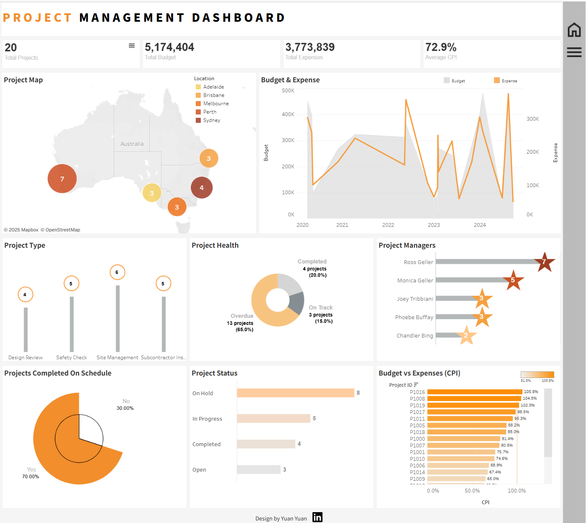
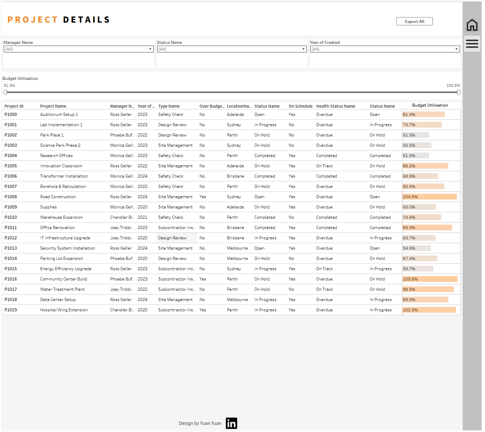

# Project Management Dashboard

This repository contains an interactive Tableau dashboard designed to visualize and monitor project performance across different locations, project types, and managers.

To **play around with the viz**, feel free to visit the online link to the live dashboard:

https://public.tableau.com/views/ProjectManagement_17507701114470/MainPage?:language=en-US&:sid=&:redirect=auth&:display_count=n&:origin=viz_share_link

## Repository Structure
<pre lang="markdown"> <code>
Project_Management_Dashboard/
│
├── data/ # Star schema source data (CSV files)
│ ├── FactProjects.csv
│ ├── DimLocation.csv
│ ├── DimManager.csv
│ ├── DimStatus.csv
│ ├── DimType.csv
│ └── DimHealthStatus.csv
│
├── data model/ # Data model in Postgres & ERD diagram and schema reference
│ ├── star_project_schema.csv
│ └── Project_ERD.png
│
├── tableau/ # Tableau workbook files
│ ├── Main_Page_Example.png
│ ├── Project_Details_Example.png
│ ├── Preferences.tps / # Custom color pallete, must be saved under your local \My Tableau Repository to create a white slice in a double pie chart.
│ └── Project Management Dashboard.twbx
│
├── icons and buttons/ # Custom icons (e.g. home/export) and visual assets
│ ├── home.png
│ ├── linkedin.png
│ └── listicon.png
│
└── README.md # Project description and documentation

 </code> </pre>
---

## Dashboard Features

- **Summary Metrics**: Total Projects, Total Budget, Total Expenses, Average CPI
- **Project Map**: Visual distribution of projects by location
- **Trend Line**: Yearly budget and expense trends
- **Project Health**: Completion and overdue status
- **Filterable Details Table**: With Budget Utilisation bar indicator
- **Export Functionality**: Allows users to download filtered data

---

## Data Model

This project uses a **Star Schema** with one fact table and five dimension tables:

- `FactProjects.csv`: Core project data including budget, expense, status
- `DimManager.csv`: Project manager info
- `DimLocation.csv`: Project location metadata
- `DimStatus.csv`: Status definitions (e.g., Completed, On Hold)
- `DimType.csv`: Project type descriptions
- `DimHealthStatus.csv`: Health/Performance status

Refer to the ERD in `data model/` for schema details.

---

## Tools Used

- Tableau Public (Dashboard Design)
- GitHub (Version Control & Hosting)
- Excel (Data Processing)
- Python (Sample Data Generation)
- Postgres (Data Storage)

---

## Preview

---

## Author

**Designed by Yuan Yuan**  

Tableau Portfolio for more vizzes! https://public.tableau.com/app/profile/yuan.yuan6421/vizzes

---

## 📄 License

This project is for educational and portfolio purposes only. All data is fictional.

